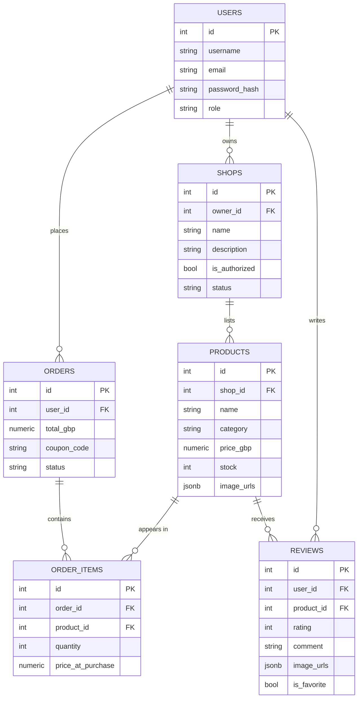

# ⚡ Weasleys' Wizard Wheezes

_A Harry Potter themed e-commerce marketplace_

## Introduction

Weasleys' Wizard Wheezes is a full-stack marketplace where multiple
wizarding shop owners sell magical joke-shop products (Skiving Snackboxes,
Love Potions, Daydream Charms, and more), and customers browse, buy, review,
and favorite them.

A shop owner can register a shop, but it stays **pending** until the
platform Admin authorizes it.a shop cannot post products before approval.
Customers browse only authorized shops, add items to a persistent cart,
check out through a themed mock "Gringotts" payment flow, track orders
through Owl Post delivery stages, and leave reviews (optionally with their
own photos). The Admin has platform-wide oversight: authorizing/suspending
shops and deleting any product directly, for example after a pattern of bad
reviews.

**Roles:** Admin, Shop Owner, Customer
**Stack:** FastAPI (Python) + PostgreSQL on the back end, React on the front
end, JWT authentication, Cloudinary for image uploads.

---

## User Stories

| #    | Role       | Story                                                                                                                                       | Acceptance Criteria                                                       |
| ---- | ---------- | ------------------------------------------------------------------------------------------------------------------------------------------- | ------------------------------------------------------------------------- |
| US01 | Customer   | As a customer, I want to register and log in, so that I can save a cart, checkout, and track my own orders.                                 | Register/login returns a JWT; guests cannot checkout or review            |
| US02 | Customer   | As a customer, I want to browse products from authorized shops only, so that I don't see unapproved or suspended sellers.                   | Product list excludes shops where `is_authorized` is false                |
| US03 | Customer   | As a customer, I want to filter products by category, so that I can find what I'm looking for quickly.                                      | Category filter returns only matching products                            |
| US04 | Customer   | As a customer, I want to view multiple images per product, so that I can see the item clearly before buying.                                | Product detail displays all URLs in `image_urls`                          |
| US05 | Customer   | As a customer, I want to add products to a cart with live stock limits, so that I can't order more than what's in stock.                    | Cart blocks quantity above current stock                                  |
| US06 | Customer   | As a customer, I want to apply a coupon code at checkout, so that I can get a discount.                                                     | Valid code reduces total; invalid code shows an error                     |
| US07 | Customer   | As a customer, I want to complete a mock checkout, so that an order is created with my cart contents.                                       | `order` + `order_items` are created; cart clears after success            |
| US08 | Customer   | As a customer, I want to view my own order history and status, so that I know where my order is.                                            | `GET /orders` returns only the logged-in user's own orders                |
| US09 | Customer   | As a customer, I want to write a review with a star rating and optional images, so that I can share my experience.                          | Review saved with rating, comment, and `image_urls`; linked to my user id |
| US10 | Customer   | As a customer, I want to edit or delete my own review, so that I can correct or remove my feedback.                                         | PUT/DELETE blocked unless `review.user_id` matches the logged-in user     |
| US11 | Customer   | As a customer, I want to mark a product as a favorite, so that I can find it again quickly.                                                 | Favorites list returns only my favorited products                         |
| US12 | Shop Owner | As a shop owner, I want to register a shop, so that I can start selling once approved.                                                      | New shop is created with `is_authorized = false` by default               |
| US13 | Shop Owner | As a shop owner, I want to be blocked from posting products until my shop is authorized, so that only approved sellers appear to customers. | `POST /products` returns 403 if `shop.is_authorized` is false             |
| US14 | Shop Owner | As a shop owner, I want to add a product with multiple images, so that customers can see it clearly.                                        | Images upload to Cloudinary via the backend; URLs saved in `image_urls`   |
| US15 | Shop Owner | As a shop owner, I want to edit or delete only my own products, so that I can't affect other shops' listings.                               | PUT/DELETE blocked unless `product.shop_id` belongs to my shop            |
| US16 | Shop Owner | As a shop owner, I want to view orders containing my products, so that I know what I need to fulfill.                                       | Orders endpoint filters `order_items` by my shop's product ids            |
| US17 | Admin      | As an admin, I want to view and authorize pending shops, so that only legitimate shops can sell.                                            | `PUT /admin/shops/{id}/authorize` flips `is_authorized` to true           |
| US18 | Admin      | As an admin, I want to suspend a shop, so that I can remove it from the platform if needed.                                                 | Suspended shop's products stop appearing to customers                     |
| US19 | Admin      | As an admin, I want to delete any product on the platform, so that I can remove items with a pattern of bad reviews.                        | `DELETE /products/{id}` succeeds for admin regardless of shop ownership   |
| US20 | Admin      | As an admin, I want to view all shops, products, and orders platform-wide, so that I have full oversight.                                   | Admin-only endpoints return all records, not just the admin's own         |

---

## ERD (Entity-Relationship Diagram)



---

## Wireframes

### 1. Register / Login

```
┌─────────────────────────────────────┐
│       Weasleys' Wizard Wheezes       │
│  ┌─────────────────────────────┐    │
│  │ Username / Email            │    │
│  └─────────────────────────────┘    │
│  ┌─────────────────────────────┐    │
│  │ Password                    │    │
│  └─────────────────────────────┘    │
│  Role: ( ) Customer ( ) Shop Owner   │
│      [  Create Account  ]            │
│   Already a wizard? Log in           │
└─────────────────────────────────────┘
```

### 2. Browse Shops & Products

```
┌─────────────────────────────────────┐
│ Home | Shops | Favorites | Cart      │
│ [All] [Snackboxes] [Potions] [More]  │
│ ┌───────┐ ┌───────┐ ┌───────┐        │
│ │ image │ │ image │ │ image │        │
│ │ Only 2│ │       │ │       │        │
│ │ left! │ │       │ │       │        │
│ │ [View]│ │ [View]│ │ [View]│        │
│ └───────┘ └───────┘ └───────┘        │
└─────────────────────────────────────┘
```

### 3. Product Detail

```
┌─────────────────────────────────────┐
│ [img1] [img2] [img3]                 │
│ Fainting Fancies — £3.50 (7 Sickles) │
│ [Add to Cart]  [Add to Favorites]    │
│ Reviews (4.6/5) — with photos        │
└─────────────────────────────────────┘
```

### 4. Cart & Checkout

```
┌─────────────────────────────────────┐
│ Fainting Fancies x2 ........ £7.00   │
│ Extendable Ears x1 ......... £4.50   │
│ Coupon: [DIAGONALLEY] [Apply]        │
│ Total: 12G 3S (£10.35)               │
│       [ Gringotts Checkout ]         │
└─────────────────────────────────────┘
```

### 5. My Orders

```
┌─────────────────────────────────────┐
│ Order #104 — In Transit (Floo)       │
│ Order #098 — Delivered               │
│ Order #091 — Owl Post Received       │
└─────────────────────────────────────┘
```

### 6. Shop Registration (Shop Owner)

```
┌─────────────────────────────────────┐
│ Shop Name:   [______________]        │
│ Description: [______________]        │
│       [ Submit for Approval ]        │
│ Status: Pending admin authorization  │
└─────────────────────────────────────┘
```

### 7. Add / Edit Product (Shop Owner)

```
┌─────────────────────────────────────┐
│ Product Name   [______________]      │
│ Category       [ dropdown ▾ ]        │
│ Price (GBP)    [______________]      │
│ Stock Quantity [______________]      │
│ Upload Images  [ choose files... ]   │
│       [   Save Product   ]           │
└─────────────────────────────────────┘
```

### 8. Admin Dashboard

```
┌─────────────────────────────────────┐
│ Pending Shop Approvals (2)           │
│  Zonko's Joke Shop   [Approve][Reject]│
│  Honeydukes Extras   [Approve][Reject]│
│ All Shops (6 approved, 1 suspended)  │
│ All Products (142) — search / delete │
└─────────────────────────────────────┘
```

_(Stretch-goal screens — Category Manager and Coupon Manager, both
Admin-only — follow the same layout pattern as the Admin Dashboard above.)_

---

## Component Hierarchy (React Frontend)

```mermaid
graph TD
    App["🪄 App.jsx<br/>(Router + AuthProvider + CartProvider)"]

    App --> Navbar["Navbar"]
    App --> Footer["Footer"]
    App --> Routes["Routes"]
    App --> RoleRoute["RoleRoute<br/>(wrapper: blocks route by role)"]

    Routes --> Login["Login"]
    Routes --> Register["Register"]

    Routes --> ProductList["ProductList<br/>(Home / Browse)"]
    ProductList --> CategoryFilter["CategoryFilter"]
    ProductList --> ProductCard1["ProductCard<br/>(repeated per product)"]

    Routes --> ProductDetail["ProductDetail"]
    ProductDetail --> ImageGallery["ImageGallery"]
    ProductDetail --> AddToCartBtn["AddToCartButton"]
    ProductDetail --> FavoriteBtn["FavoriteButton"]
    ProductDetail --> ReviewList["ReviewList"]
    ReviewList --> ReviewCard["ReviewCard<br/>(repeated per review)"]
    ProductDetail --> ReviewForm["ReviewForm<br/>(rating + comment + images)"]

    Routes --> Cart["Cart"]
    Cart --> CartItem["CartItem<br/>(repeated per item)"]
    Cart --> CouponForm["CouponForm"]
    Cart --> CheckoutBtn["CheckoutButton"]

    Routes --> Checkout["Checkout<br/>(Gringotts mock payment)"]

    Routes --> MyOrders["MyOrders"]
    MyOrders --> OrderCard["OrderCard<br/>(repeated, shows status)"]

    Routes --> Favorites["Favorites"]
    Favorites --> ProductCard2["ProductCard<br/>(reused component)"]

    Routes --> ShopRegister["ShopRegistration"]

    Routes --> ShopDashboard["ShopDashboard"]
    ShopDashboard --> MyProductsTable["MyProductsTable"]
    ShopDashboard --> ShopOrdersList["ShopOrdersList"]

    Routes --> AddEditProduct["AddEditProduct"]
    AddEditProduct --> ImageUploader["ImageUploader<br/>(Cloudinary)"]

    Routes --> AdminDashboard["AdminDashboard"]
    AdminDashboard --> ShopApprovalList["ShopApprovalList<br/>(approve/suspend)"]
    AdminDashboard --> AllProductsTable["AllProductsTable<br/>(moderate/delete any)"]
    AdminDashboard --> AllOrdersTable["AllOrdersTable"]

    %% ===== Color classes =====
    classDef core fill:#3b2a5c,color:#ffffff,stroke:#2a1d42,stroke-width:1px;
    classDef shared fill:#5b7fb5,color:#ffffff,stroke:#3f5f8f,stroke-width:1px;
    classDef customer fill:#2f8f5b,color:#ffffff,stroke:#1f6b41,stroke-width:1px;
    classDef shopowner fill:#c9962c,color:#ffffff,stroke:#9c7220,stroke-width:1px;
    classDef admin fill:#a13d3d,color:#ffffff,stroke:#7a2d2d,stroke-width:1px;
    classDef reused fill:#2b8c8c,color:#ffffff,stroke:#1e6666,stroke-width:1px;

    class App,Routes,RoleRoute core;
    class Navbar,Footer,Login,Register shared;
    class ProductList,CategoryFilter,ProductDetail,ImageGallery,AddToCartBtn,FavoriteBtn,ReviewList,ReviewCard,ReviewForm,Cart,CartItem,CouponForm,CheckoutBtn,Checkout,MyOrders,OrderCard,Favorites customer;
    class ShopRegister,ShopDashboard,MyProductsTable,ShopOrdersList,AddEditProduct,ImageUploader shopowner;
    class AdminDashboard,ShopApprovalList,AllProductsTable,AllOrdersTable admin;
    class ProductCard1,ProductCard2 reused;
```



**Color key:** 🟣 Purple = core app shell · 🔵 Blue = shared/public pages · 🟢 Green = Customer-only pages · 🟡 Gold = Shop Owner-only pages · 🔴 Red = Admin-only pages · 🟦 Teal = reused component (same component, multiple places)

### Shared context / state (not rendered components, but wrap the tree)

| Context       | Purpose                                                                            | Used by                                                           |
| ------------- | ---------------------------------------------------------------------------------- | ----------------------------------------------------------------- |
| `AuthContext` | Stores logged-in user, JWT token, role; provides login/logout functions            | Navbar, RoleRoute, every page that needs `user.role` or `user.id` |
| `CartContext` | Stores cart items in memory (not a DB table), provides add/remove/update functions | ProductDetail (Add to Cart), Cart, Checkout                       |

### Reused components

- `ProductCard` is used in both `ProductList` and `Favorites` — same component, different data source
- `RoleRoute` wraps `ShopRegistration`, `ShopDashboard`, `AddEditProduct` (Shop Owner only) and `AdminDashboard` (Admin only), redirecting anyone without the right role

---

## API Routes

All routes except register/login require a JWT in the `Authorization`
header. Role checks are enforced server-side.

| Method | Route                         | Purpose                                             | Access                         |
| ------ | ----------------------------- | --------------------------------------------------- | ------------------------------ |
| POST   | `/auth/register`              | Sign up (choose role)                               | Public                         |
| POST   | `/auth/login`                 | Sign in, returns JWT                                | Public                         |
| GET    | `/me`                         | Current user profile                                | Logged in                      |
| POST   | `/shops`                      | Register a new shop                                 | Shop Owner                     |
| GET    | `/shops/mine`                 | View my shop                                        | Shop Owner                     |
| GET    | `/shops`                      | List authorized shops                               | Public                         |
| GET    | `/admin/shops`                | List all shops incl. pending                        | Admin                          |
| PUT    | `/admin/shops/{id}/authorize` | Approve/suspend a shop                              | Admin                          |
| POST   | `/upload-image`               | Upload one image to Cloudinary, return URL          | Shop Owner / Customer          |
| GET    | `/products`                   | List/search/filter products (authorized shops only) | Public                         |
| GET    | `/products/{id}`              | Product detail incl. images + reviews               | Public                         |
| POST   | `/products`                   | Add product (blocked if shop not authorized)        | Shop Owner                     |
| PUT    | `/products/{id}`              | Edit own product                                    | Shop Owner (own)               |
| DELETE | `/products/{id}`              | Delete product                                      | Shop Owner (own) / Admin (any) |
| GET    | `/admin/products`             | List all products platform-wide                     | Admin                          |
| POST   | `/orders`                     | Checkout (creates order + order_items)              | Customer                       |
| GET    | `/orders`                     | My order history                                    | Customer (own)                 |
| GET    | `/shops/{id}/orders`          | Orders containing my shop's products                | Shop Owner                     |
| GET    | `/admin/orders`               | All orders platform-wide                            | Admin                          |
| POST   | `/reviews`                    | Add review (rating, comment, optional images)       | Customer                       |
| GET    | `/reviews/{product_id}`       | List reviews for a product                          | Public                         |
| PUT    | `/reviews/{id}`               | Edit own review                                     | Customer (own)                 |
| DELETE | `/reviews/{id}`               | Delete review                                       | Customer (own) / Admin (any)   |
| GET    | `/favorites`                  | List my favorited products                          | Customer                       |
| POST   | `/coupons/validate`           | Check a coupon code                                 | Customer                       |

---

## Technologies Used

- **Frontend:** React, React Router, Axios, CSS (Flexbox/Grid)
- **Backend:** Python, FastAPI, SQLAlchemy, JWT (python-jose), Passlib (bcrypt)
- **Database:** PostgreSQL
- **Image hosting:** Cloudinary
- **Deployment:** Vercel (frontend), Render (backend)

## Attributions

Product names and categories are inspired by J.K. Rowling's Harry Potter
series (Weasleys' Wizard Wheezes); all product descriptions, images, and
code in this project are original. No official movie stills, logos, or book
text are used.

## Next Steps (Stretch Goals)

- Move `categories` into a proper relational table managed by the Admin
- Move `coupons` into an admin-managed table with activation/expiry dates
- Real payment integration (Stripe test mode) instead of a mock checkout
- Email notifications when an order status changes
